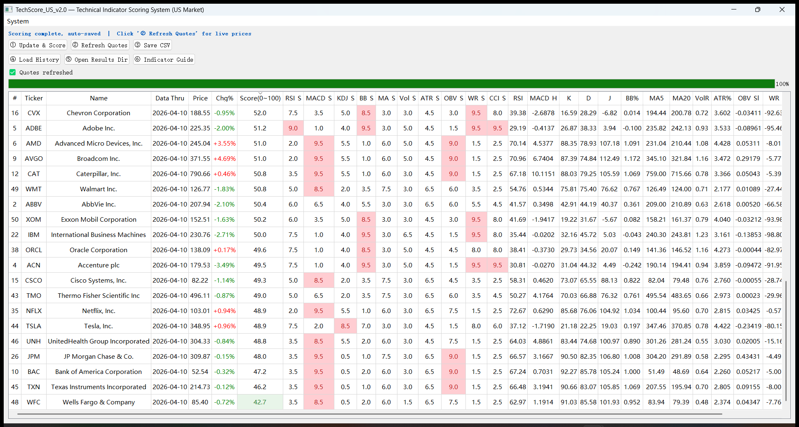
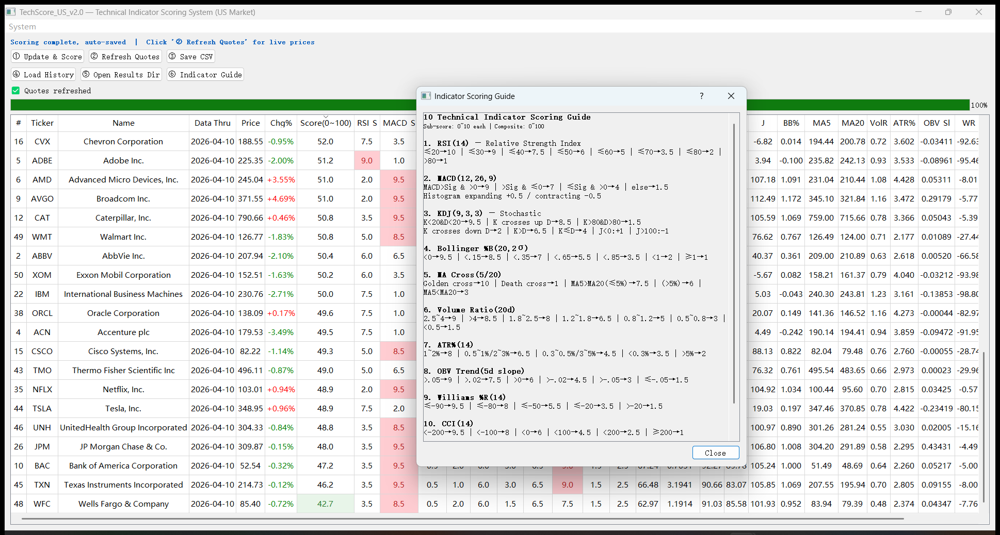

# TechScore US — Technical Indicator Stock Scorer

A **10-indicator composite scoring system (0–100)** for US stocks. Available as a **desktop app** (PyQt5) and a **free online web app** (Streamlit).

---

## 🌐 Try It Online — No Install Required

> **👉 [https://techscoreus-ztfzltktgnuxnvcjv5pk4n.streamlit.app/](https://techscoreus-ztfzltktgnuxnvcjv5pk4n.streamlit.app/)**

The Streamlit web version runs entirely in your browser. Zero install, zero cost.

| | Desktop (PyQt5) | Web (Streamlit) |
|---|---|---|
| **Install required?** | Yes — Python + pip | **No** — just open the link |
| **Where it runs** | Your local machine | Streamlit Community Cloud |
| **Stock pools** | S&P 500, NASDAQ-100, Dow 30, single ticker | Same |
| **10 indicators + scoring** | ✅ | ✅ |
| **Real-time quote refresh** | ✅ | — (planned) |
| **CSV export** | Auto-save to local folder | Download button in browser |
| **Double-click → Yahoo Finance** | ✅ | Clickable ticker links |
| **Company name lookup** | ✅ (slow for large pools) | Omitted (avoids cloud timeout) |
| **Proxy / VPN needed in China?** | Yes | **No** — cloud server fetches data |

---

## Features

- **10 Technical Indicators** — RSI, MACD, KDJ, Bollinger %B, MA Cross, Volume Ratio, ATR%, OBV Trend, Williams %R, CCI
- **Multiple Stock Pools** — S&P 500, NASDAQ-100, Dow Jones 30, or single ticker lookup
- **Composite Scoring** — Weighted average of 10 sub-scores, normalized to 0–100
- **Real-time Quotes** — Refresh current price & daily change % via Yahoo Finance (desktop)
- **Auto-save CSV** — Results auto-saved with timestamps; reload anytime
- **Color-coded Table** — High scores highlighted in red, low scores in green; sortable columns
- **Score Distribution Chart** — Visual histogram of score ranges (web version)
- **Double-click to Web** — Opens Yahoo Finance page for any stock (desktop)
- **Auto-load on Startup** — Automatically loads the most recent CSV when reopened (desktop)

---

## Screenshots

### Desktop — Main Scoring Interface

### Desktop — Indicator Scoring Guide

---

## Quick Start — Desktop Version (PyQt5)

### 1. Install Dependencies

    pip install yfinance pandas numpy PyQt5

### 2. Run

    python techscore_us.py

### 3. Basic Workflow

1. Click **Update & Score** → Select stock pool (start with "Test 10 stocks") → OK
2. Wait for download & scoring to complete (auto-saves CSV)
3. Click **Refresh Quotes** to get latest prices
4. Double-click any row to open its Yahoo Finance page
5. Click column headers to sort (e.g., sort by Score descending)

---

## Quick Start — Web Version (Streamlit)

### Option A: Use the Hosted App (Recommended)

Just open **[https://techscoreus-ztfzltktgnuxnvcjv5pk4n.streamlit.app/](https://techscoreus-ztfzltktgnuxnvcjv5pk4n.streamlit.app/)** in your browser.

1. In the left sidebar, select **Stock Pool** or enter a **Single Ticker**
2. Adjust the **History (calendar days)** slider (recommend ≥ 150)
3. Click **🚀 Run Scoring** and wait for the progress bar to finish
4. View results in the color-coded table; filter by score range
5. Click **⬇️ Download CSV** to save results locally

### Option B: Run Locally

    pip install streamlit yfinance pandas numpy lxml html5lib
    streamlit run streamlit_app.py

Opens automatically at http://localhost:8501.

### Option C: Deploy Your Own Instance

1. Fork this repo
2. Go to [share.streamlit.io](https://share.streamlit.io) → Sign in with GitHub
3. **New app** → Select your fork → Branch: main → Main file path: streamlit_app.py
4. Click **Deploy** → Wait 2–3 minutes → Your app is live

---

## For Users in Regions with Restricted Internet Access

> **💡 The Streamlit web version does NOT require a proxy or VPN** — the cloud server fetches data from Yahoo Finance directly. If you're in China, the web version is the easiest option.

The desktop version uses yfinance which accesses query1.finance.yahoo.com. This may be blocked or unstable in certain countries or regions.

### Option A: Switch VPN / Proxy to Global Mode

If your VPN or proxy client (e.g., Clash, V2rayN, Shadowsocks, Surge, WireGuard, etc.) is running, switch to **Global Mode** and run directly:

    python techscore_us.py

### Option B: Set Proxy Environment Variable

Find your proxy client's local HTTP port, then:

**Linux / macOS:**

    export HTTPS_PROXY=http://127.0.0.1:7890
    export HTTP_PROXY=http://127.0.0.1:7890
    python techscore_us.py

**Windows CMD:**

    set HTTPS_PROXY=http://127.0.0.1:7890
    set HTTP_PROXY=http://127.0.0.1:7890
    python techscore_us.py

**Windows PowerShell:**

    $env:HTTPS_PROXY="http://127.0.0.1:7890"
    $env:HTTP_PROXY="http://127.0.0.1:7890"
    python techscore_us.py

| Proxy Client | Common Port |
|---|---|
| Clash | 7890 |
| V2rayN | 10809 |
| Shadowsocks | 1080 |
| Surge | 6152 |

> **Tip:** If your browser can open finance.yahoo.com but the script times out, it usually means your proxy only covers browser traffic. Setting the environment variables above will route Python's traffic through the proxy as well.

---

## Indicator Weights & Scoring

| Indicator | Weight | What It Measures |
|---|---|---|
| **MACD(12,26,9)** | 15% | Trend momentum & direction |
| **RSI(14)** | 12% | Overbought / oversold |
| **KDJ(9,3,3)** | 12% | Stochastic momentum |
| **MA Cross(5/20)** | 12% | Short vs medium trend |
| **Bollinger %B(20)** | 10% | Price position within bands |
| **Volume Ratio(20d)** | 10% | Current vs average volume |
| **OBV Trend(5d)** | 10% | Volume-weighted price direction |
| **ATR%(14)** | 7% | Volatility as % of price |
| **Williams %R(14)** | 6% | Momentum oscillator |
| **CCI(14)** | 6% | Price deviation from mean |

### Scoring Philosophy

> **Higher score = more oversold / bullish signals.**
>
> This is a **contrarian / mean-reversion** scoring model. A score of 80+ means the stock is showing multiple oversold signals — it does **not** guarantee a rebound.

### Score Ranges

| Score | Interpretation | Table Color |
|---|---|---|
| 75–100 | Strongly oversold / bullish signals | Red background |
| 60–74 | Moderately oversold | Orange background |
| 45–59 | Neutral | No highlight |
| 0–44 | Overbought / bearish signals | Green background |

---

## File Structure

    techscore-us/
    ├── LICENSE                    # GPLv3
    ├── README.md
    ├── requirements.txt           # Streamlit Cloud dependencies
    ├── techscore_us.py            # Desktop app (PyQt5)
    ├── streamlit_app.py           # Web app (Streamlit)
    ├── main_us.png                # Screenshot: main window
    ├── techexplain_us.png         # Screenshot: indicator guide
    └── TechScore_Data_US/         # Auto-created at runtime by desktop version (git-ignored)
        ├── pool_cache.json        # Stock pool cache (7-day TTL)
        └── Predictions/
            └── TechScore_US_2025-XX-XX_XXXX.csv

---

## Performance Notes

| Stock Pool | Tickers | Download Time* | Scoring Time |
|---|---|---|---|
| Test 10 | 10 | ~10 sec | < 1 sec |
| Dow 30 | 30 | ~15 sec | < 1 sec |
| NASDAQ-100 | ~100 | ~30 sec | ~2 sec |
| S&P 500 | ~500 | ~1–3 min | ~5 sec |

*Download times depend on network speed and Yahoo Finance rate limits. Uses batch yf.download() for efficiency. Streamlit Cloud may be slightly slower due to shared resources.

---

## Requirements

### Desktop Version
- **Python** 3.8+
- **OS**: Windows / macOS / Linux
- **Libraries**: yfinance>=0.2.31, pandas>=1.5, numpy>=1.23, PyQt5>=5.15

### Web Version
- **Python** 3.8+
- **Libraries** (see requirements.txt): streamlit>=1.32.0, yfinance>=0.2.36, pandas>=2.0, numpy>=1.24, lxml, html5lib
- Or just use the [hosted app](https://techscoreus-ztfzltktgnuxnvcjv5pk4n.streamlit.app/) — no local install needed

---

## Disclaimer

**This software is for research and educational purposes only.**

- It does not constitute any investment advice or recommendation.
- All investment decisions and associated risks are solely the responsibility of the user.
- Past technical indicator patterns do not guarantee future price movements.

---

## License

This project is licensed under the [GNU General Public License v3.0](LICENSE).

---

## Related Projects

- [**OpenStockTechScore**](https://github.com/tsiwt/OpenStockTechScore) — A-share market version with local data providers

---

## Contributing

Contributions are welcome! Please feel free to:

1. Open an [Issue](../../issues) for bugs or feature requests
2. Submit a [Pull Request](../../pulls) with improvements
3. ⭐ Star this repo if you find it useful
